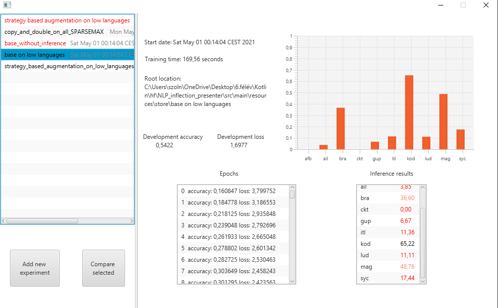

# Kotlin Homework - experiment representer

## Description

This is a Kotlin based JavaFX application that aims to help users (me) view and compare different morphological experiments. The application does not store the experiments registered, but it tries to keep count of them. The format of these experiment's folders has to meet some requirements (these are listed below).

To make it possible to try out the program, I've placed 4 previous experiment folders into the project as resources (`resources/store/*`). One of them is not fully complete so that the application can be tested on semi-finished results too.

## Instructions on using the application

- Start the application.
- The opened window is the main view of the application. A new experiment can be added via the button "Add new experiment".
- After pressing the button navigate to the root of one of the pre-added experiment directories (for example: `resources/store/strategy_based_augmentation_on_low_languages`) and select it.
- You now should have a folder added to the list of experiments and its properties should also be presented as on the example image above.
- You can compare experiments after registering at least one of them in the application (you can compare one with itself if it is hearfully desired). Choose one of the experiments, then press the "Compare selected" button. Afterwards the selection on the list of experiments should be removed. Click on the other experiment you want to compare the previously chosen one with. As a result a new view with the results of comparison should appear.
- You can go back to the main view with the "back" button.

 ## Formal requirements of a proper experiment directory
It may seem that a proper directory should fulfill too much requirements, but in reality, all of these directories are generated (and none of them are created by hand), so they can be relied on easily. On the other hand, we can also import semi-finished results. These are highlited as red on the list of experiments, but the application can still present the data that can be extracted from them.
 
 - The directory should contain a `result.yaml` file
 - The result.yaml should contain at least 4 key-value pairs: dev_acc, dev_loss, running_time, start_time. The first three of them should have long values, the last one should have a Date value.
 - (At max 3 depth from the root) the directory should contain a `train.log` file.
 - The train.log file should contain information about epochs. An epoch should look similar to this (important parts are highlighted):
>`[`2021-05-03 14:34:00,058][train][INFO`]` - `Epoch: 0`  
>[2021-05-03 14:34:00,058][train][INFO] -   train accuracy: 0  train loss: 0  
>`[`2021-05-03 14:34:00,058][train][INFO`]` -   `dev accuracy: 0.953769862651825  dev loss: 0.050241950899362564`

- (At max 3 depth from the root) the directory should contain a `result_csv` file.
- the result.csv should contain the inference results (each result in a new line)
- An inference result is presented by the character code of the language and a double value separated from each other by a comma.
- An example inference result:
>tyv,0.9905486071631608

